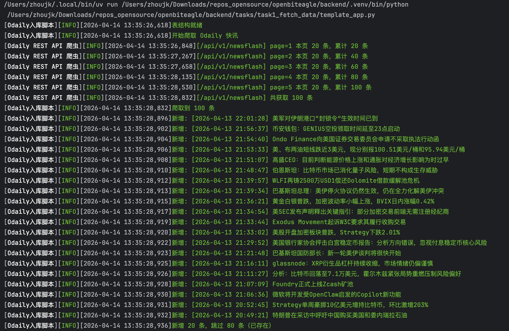
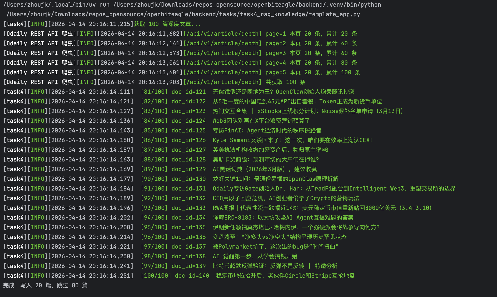
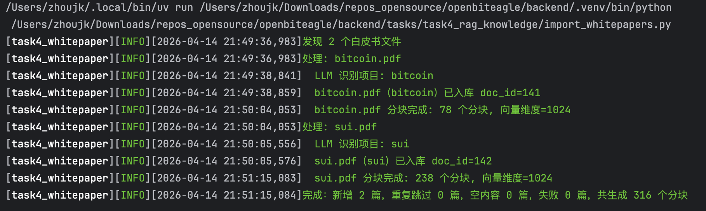
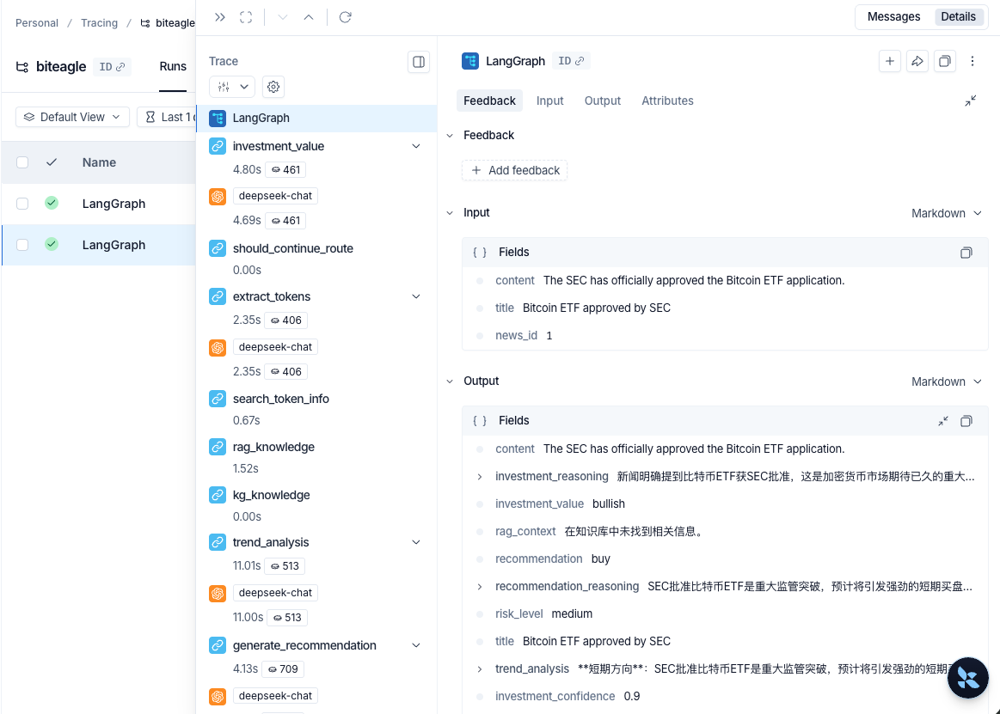
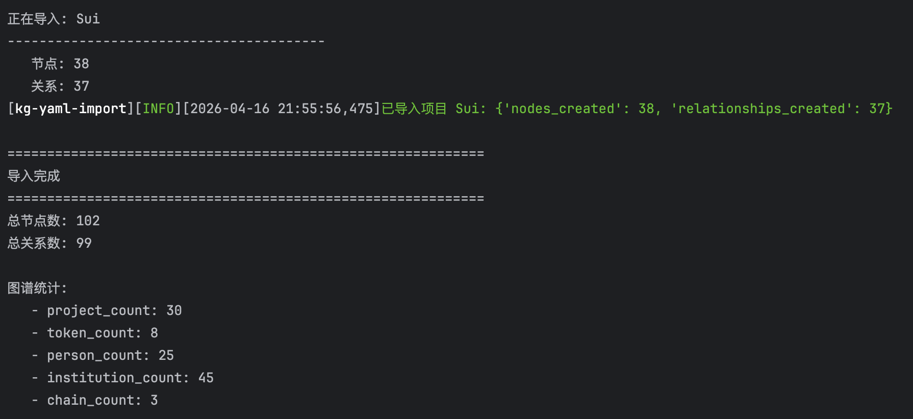
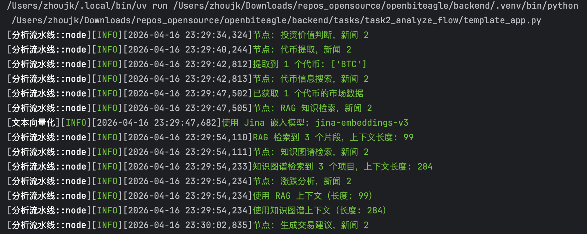

# OpenBiteagle

AI 驱动的 Web3 投资分析系统，从 Odaily 快讯获取 Web3 行业新闻，通过多阶段 AI 分析流水线对每条快讯进行投资价值分析，判断是否具有投资价值，如果有价值则提取相关代币，并分析代币的涨跌趋势，给出买入/卖出建议。

## 目标指标

- 投资分析准确率 ≥ 90%
- 代币命中准确率 ≥ 90%

## 技术栈

- **后端**: Python 3.12+ / FastAPI / Pydantic
- **数据库**: PostgreSQL / SQLAlchemy / Redis / Neo4j
- **LLM**: LangChain / LangGraph / LangSmith
- **消息队列**: RabbitMQ

## 目录结构

```
backend/   # 后端服务
frontend/  # 前端界面
infra/     # 基础设施
```

## 任务

### ✅ 任务 1：数据获取

> Odaily快讯页地址：https://www.odaily.news/zh-CN/newsflash
> Odaily Restful API：https://github.com/ODAILY/REST-API

从Odaliy获取快讯并存入数据库，3步：

- 从Odaily快讯页获取 Web3 行业快讯数据：快讯标题、正文内容 等可用信息
- 进行数据清洗：去除 HTML 标签、处理编码问题、过滤无效数据
- 设计合理的数据表结构，将清洗后的数据存入PostgreSQL

**Odaily页面简单描述**

手动操作：点击左边「快讯」标签，来到快讯页，默认显示全部快讯，点击上面可以切换不同主题的快讯。

页面逻辑：快讯页是按照日期-时刻倒序排列的，包含「标题、正文内容」，可能还会包含一个原文链接。这三者就是要抓取到的信息。

**可以直接使用Odaily提供的REST接口请求数据，不用爬取。**

运行结果如下：



图-数据获取结果

### ✅ 任务 2：分析流水线

工作流包含5个关键节点：

- 投资价值判断：分析快讯是否具有投资价值（利好/利空/无关），输出判断结果和置信度
- 代币提取：从有价值的快讯中提取相关代币（名称、符号），如果无关联代币则标记为无
- 代币信息搜索：对提取到的代币搜索补充市场信息（当前价格、市值）
- 涨跌分析：结合快讯内容和代币信息，分析代币短期涨跌趋势，给出买入/卖出/观望建议
- 路由节点：根据投资价值判断结果决定是否继续后续分析（无投资价值的快讯跳过深度分析）

分析结果示例：

```
news_id: 1
title: Bitcoin ETF approved by SEC
content: The SEC has officially approved the Bitcoin ETF application.
investment_value: bullish
investment_confidence: 0.9
investment_reasoning:
	新闻明确提到比特币ETF获SEC批准，这是市场期待已久的重大监管突破，将显著降低传统投资者进入比特币市场的门槛，带来大量新增资金和流动性，属于实质性利好。信息来源（SEC）权威可靠，事件可验证。预计将引发极高市场关注和交易量增长，对比特币价格构成强劲支撑。
tokens: [{'symbol': 'BTC', 'name': 'Bitcoin', 'confidence': 1.0}]
token_details: {'
	BTC': {'symbol': 'BTC', 'name': 'Bitcoin', 'price': 74363.06214430548, 'market_cap': 1488416844871.8323, 'change_24h': 5.05672847, 'volume_24h': 50261264411.2303}
	}
rag_context: 在知识库中未找到相关信息。
rag_sources: []
kg_context: None
kg_entities: {}
trend_analysis:
	**短期方向**：消息公布后，市场可能出现"利好出尽"的短期抛售或剧烈波动，但机构资金准入的实质性改善将构成强劲中期支撑。
  **关键因素**：ETF的持续资金流入量、传统机构配置速度，以及知识库中未提及但需关注的灰度GBTC等现有产品的资金流向转换。
  **风险考量**：若ETF初期资金流入不及预期，或出现监管后续审查等不确定性，可能削弱看涨情绪；比特币网络基本面（如交易拥堵、高手续费）若未改善，可能限制长期机构参与度。
  **时间范围**：资金流入驱动的主升趋势可能持续数周至数月，但短期情绪化波动将在1-2周内逐步平复。

  **趋势分析**：SEC批准比特币ETF将打开传统资本大规模配置的通道，中期流动性预期强劲。然而，短期需警惕"买预期卖事实"的获利了结压力，且后续资金流入的实际规模将是趋势延续的关键。若机构入场速度缓慢，涨势可能逐步收敛。
recommendation: buy
risk_level: medium
recommendation_reasoning:
	SEC批准比特币ETF是结构性利好，为传统资本大规模流入打开了通道，中期基本面强劲。尽管短期可能因'利好出尽'出现波动，但稳健型策略应着眼于中期趋势。建议在潜在短期回调或波动中分批买入，以捕捉机构资金驱动的长期上涨潜力，同时通过分批建仓管理短期风险。
should_continue: True
```

### ✅ 任务 3：消息队列驱动

使用消息队列实现上一个任务的异步处理，3步：

- API收到分析请求后，将任务发送到RabbitMQ队列
- Worker消费消息队列消息，触发LangGraph分析流水线
    - 支持幂等消费：同一任务不重复处理
    - 支持并发控制：限制同时处理的任务数量
    - 处理失败时进行重试，超过重试次数进入死信队列
- 分析完成后将结果写入数据库

### ✅ 任务 4：RAG知识库

增强RAG分析能力，构建知识库并实现检索，4步：

- 使用 PostgreSQL + pgvector 作为向量数据库
- 导入至少50篇领域知识，做好分块和向量化，从3个来源下载
    - Web3 项目白皮书（可在 [Rootdata](https://www.rootdata.com/zh) 上寻找项目方）
        - 在项目->项目名->项目页面上侧的Doc或着WhitePaper里面就是白皮书链接，或者github仓库里面有白皮书，或者其他地方
    - Odaily / 其他 Web3 媒体的深度分析文章
    - 代币经济学相关文档
- 在分析流水线的相关节点中集成RAG检索，让AI基于检索到的知识进行更加准确的投资建议

最后需要评估效果：

- 对比有无RAG的分析效果差异，写入README



图-获取Odaily深度文章



图-项目白皮书入库

### ✅ 任务 5：HTTP API

实现FastAPI接口，作为系统的对外入口。3步：

- 提交分析：接收快讯ID或快讯内容，将分析任务发送到消息队列
    - 批量提交：支持批量提交多条快讯进行分析
- 查询结果：根据快讯ID查询投资分析结果（支持查看每格步骤的结果）
    - 分析概览：返回分析统计（利好/利空分布、推荐代币排行、建议分布等）
- 设计合理的请求/响应数据模型和错误处理

### ✅ 任务 6：可观测性

大模型应用是黑盒，使用LangSmith实现全链路追踪。

- 接入LangSimth，所有LLM调用和LangGraph流水线执行自动上报Trace
    - 每条快讯的分析全链路可追踪：从投资价值判断到最终建议，每个节点的输入输出、耗时、token消耗都能在LangSmith上看到
    - 能够通过LangSmith定位分析不准确的案例，找到具体是哪个节点出了问题

langsmith界面查看langgraph流水线执行结果如下：



图-langsmith界面查看langgraph流水线执行结果

### ✅ 任务 7：知识图谱

使用知识图谱补充实体关系信息。

在rootdata的项目详情页找到项目的团队成员、投融资等关系信息。

- 使用Neo4j作为图数据库
- 定义节点类型：项目、代币、人物、公链、投资机构等
- 定义关系类型：发行、投资、属于、合作等



图-添加项目到知识图谱


## 完整案例

**新闻**

```
"news_id": 2,
"title": "Bitcoin ETF approved by SEC",
"content": "The SEC has officially approved the Bitcoin ETF application."
```

**日志**



图-工作流运行日志

**结果**

- 预测结果

  ```
  news_id: 2
  title: Bitcoin ETF approved by SEC
  content: The SEC has officially approved the Bitcoin ETF application.
  investment_value: bullish
  investment_confidence: 0.9
  investment_reasoning: 新闻明确提到比特币ETF获SEC批准，这是加密货币市场期待已久的重大监管突破，将显著降低传统投资者进入比特币市场的门槛，带来大量新增资金流入预期。信息来源（SEC）权威可靠，事件具有里程碑意义，极可能引发市场高度关注和交易量激增，对比特币及整个加密市场构成实质性利好。
  tokens: [{'symbol': 'BTC', 'name': 'Bitcoin', 'confidence': 1.0}]
  ```

- 推理过程

  ```
  token_details: {'BTC': {'symbol': 'BTC', 'name': 'Bitcoin', 'price': 74364.19153583348, 'market_cap': 1488523556153.7634, 'change_24h': 0.38363839, 'volume_24h': 40404406940.62615}}
  rag_context: 根据提供的上下文，没有明确信息表明美国证券交易委员会（SEC）在2026年批准了比特币ETF。上下文提到比特币现货ETF是在**2024年1月**获批的，并重点描述了其在2026年的发展状况和影响。
  rag_sources: [{'chunk_id': 536, 'similarity': np.float32(0.81688404)}, {'chunk_id': 535, 'similarity': np.float32(0.8012183)}, {'chunk_id': 532, 'similarity': np.float32(0.7725047)}]
  kg_context: ## Related Projects (3)
  - BTC: No description
  - BTC Digital: No description
  - BitcoinOS: No description

  ## Entity Relationships (21)
  - Person: Michael Ford (核心开发者)
  - Person: Ava Chow (核心开发者)
  - Person: Hennadii Stepanov (核心贡献者)
  - Person: Gloria Zhao (核心维护者)
  - Person: Portland (核心贡献者)
  kg_entities: {'projects': [{'name': 'BTC'}, {'name': 'BTC Digital'}, {'name': 'BitcoinOS'}], 'tokens': [], 'relationships': [{'person': {'name': 'Michael Ford'}, 'relationship': 'WORKS_AT', 'role': '核心开发者'}, {'person': {'name': 'Ava Chow'}, 'relationship': 'WORKS_AT', 'role': '核心开发者'}, {'person': {'name': 'Hennadii Stepanov'}, 'relationship': 'WORKS_AT', 'role': '核心贡献者'}, {'person': {'name': 'Gloria Zhao'}, 'relationship': 'WORKS_AT', 'role': '核心维护者'}, {'person': {'name': 'Portland'}, 'relationship': 'WORKS_AT', 'role': '核心贡献者'}, {'person': {'name': 'Luke Dashjr'}, 'relationship': 'WORKS_AT', 'role': '核心开发者'}, {'institution': {'name': 'Blockchain Capital'}, 'round_type': '主要投资机构', 'amount': None}, {'institution': {'name': 'Pantera Capital'}, 'round_type': '主要投资机构', 'amount': None}, {'institution': {'name': 'Digital Currency Group'}, 'round_type': '主要投资机构', 'amount': None}, {'institution': {'name': 'Union Square Ventures'}, 'round_type': '主要投资机构', 'amount': None}, {'institution': {'name': 'a16z'}, 'round_type': '主要投资机构', 'amount': None}, {'institution': {'name': 'Y Combinator'}, 'round_type': '主要投资机构', 'amount': None}, {'institution': {'name': 'Plug and Play'}, 'round_type': '主要投资机构', 'amount': None}, {'institution': {'name': 'Boost VC'}, 'round_type': '主要投资机构', 'amount': None}, {'institution': {'name': 'Valor Equity Partners'}, 'round_type': '主要投资机构', 'amount': None}, {'institution': {'name': 'Accomplice'}, 'round_type': '主要投资机构', 'amount': None}, {'institution': {'name': 'Ribbit Capital'}, 'round_type': '主要投资机构', 'amount': None}, {'institution': {'name': 'Founders Fund'}, 'round_type': '主要投资机构', 'amount': None}, {'institution': {'name': 'DNA Fund'}, 'round_type': '近期比特币原生项目融资（2024-2025年）（2025）', 'amount': '1000万美元'}, {'institution': {'name': 'FalconX'}, 'round_type': '近期比特币原生项目融资（2024-2025年）（2025）', 'amount': '1000万美元'}, {'institution': {'name': 'Greenfield Capital'}, 'round_type': '近期比特币原生项目融资（2024-2025年）（2025）', 'amount': '1000万美元'}]}
  trend_analysis: **短期方向**：新闻虽为旧闻（SEC已于2024年1月批准比特币现货ETF），但若市场误读为“新批准”，可能引发短暂情绪性买盘，推动BTC价格小幅冲高。  

  **关键因素**：实际价格驱动将依赖ETF的持续资金流入（知识库显示2026年ETF已成为主流投资渠道）及宏观流动性，而非“获批”本身。  

  **风险考量**：若ETF资金流入放缓或出现净流出（反映在知识库中的“发展状况”数据），或比特币网络开发进展滞后（如知识库提及的核心开发者贡献减少），涨势可能逆转。  

  **时间范围**：情绪性影响仅持续数小时至数日，中长期趋势仍取决于ETF资金流与比特币生态基本面。
  recommendation: hold
  risk_level: medium
  recommendation_reasoning: 新闻为旧闻，短期情绪性买盘可能带来小幅冲高但不可持续。中长期趋势取决于ETF资金流和比特币生态基本面，当前信号中性且不确定性较高。作为稳健型交易，应等待更明确的催化剂或价格驱动因素。
  should_continue: True
  ```


## 许可证

MIT
